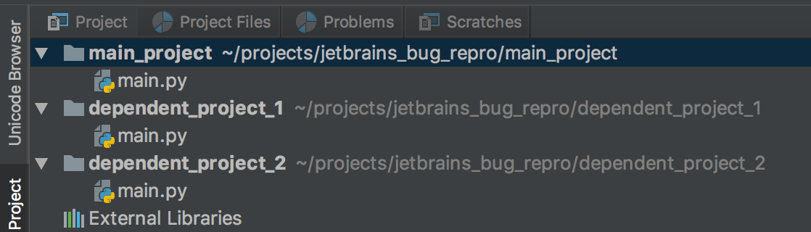

# jetbrains_bug_repro

You should manually open the folders as the main project and dependent project like the following:

- main project: `main_project`

- dependent project 1: `dependent_project_1`

- dependent project 2: `dependent_project_2`

  ​

